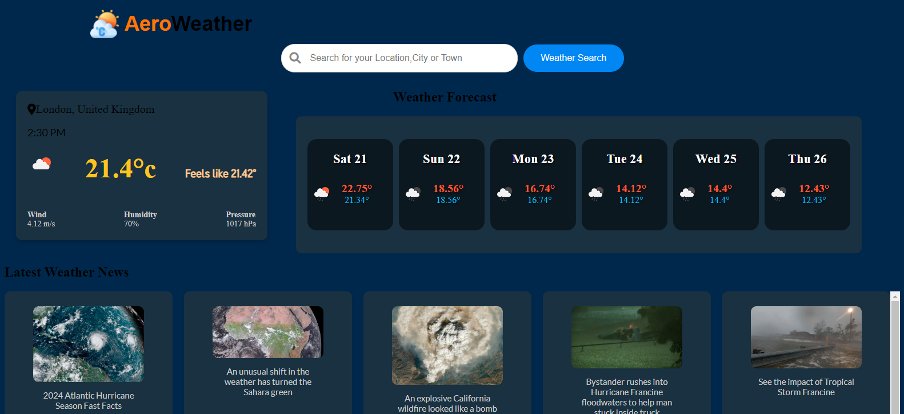

# AEROWEATHER
This is a simple web application that fetches the weather of a specified
location and displays.
The weather information is fetched from OpenWeatherMap. The application 
updates it's background by fetching an image of the searched city from 
Unsplash.
The app also allows using of the current location to fetch the weather.
Recently searched locations are stored in browser localStorage and are displayed when the page loads and after performing 
searches.

## Preview of the Application
)